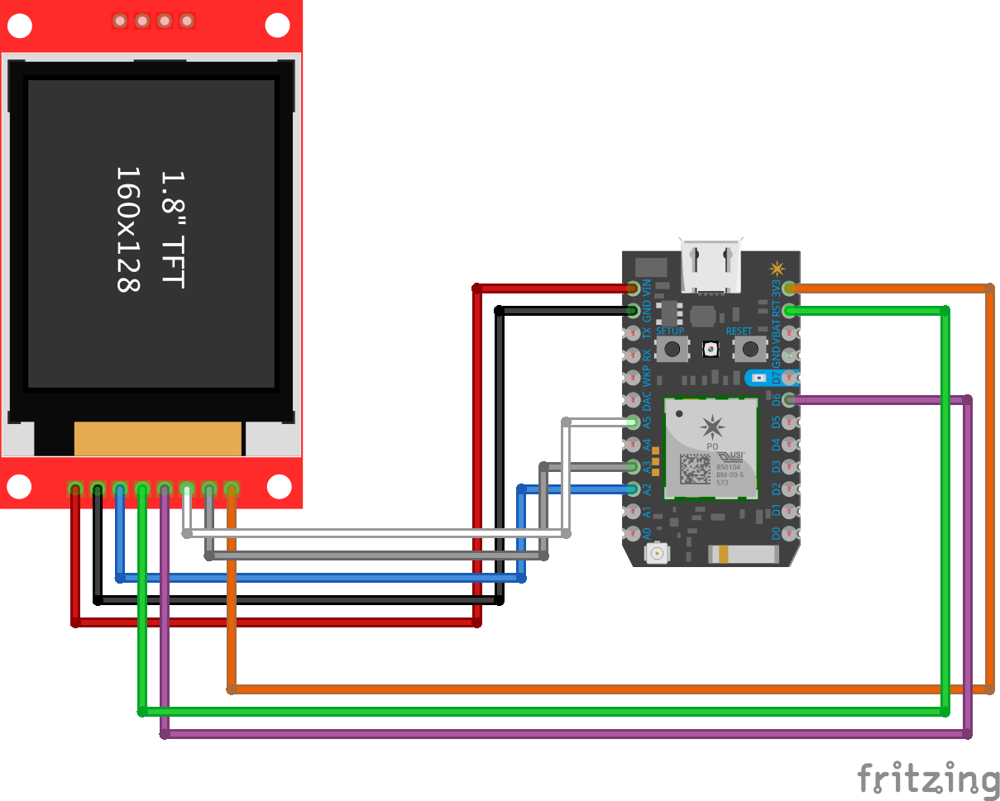

# TFT 1.8' Spi Display 180x160 ST3775

> TFT 1.8' Spi Display 180x160 using ST3775 [Particle Photon](https://docs.particle.io/photon/)

## Libraries
This project uses several libraries:
- [Adafruit_GFX_RK](https://github.com/rickkas7/Adafruit_GFX_RK)
- [Adafruit_ST7735_RK](https://github.com/rickkas7/Adafruit_ST7735_RK)

## The Circuit:


You can also open the Frizting file [here](tft-st3775-display.fzz)

|   	| TFT 	| PHOTON 	|
|---	|-----	|--------	|
| 1 	| VCC 	| VIN 5v 	|
| 2 	| GND 	| GND    	|
| 3 	| CS  	| A2     	|
| 4 	| RST 	| RST    	|
| 5 	| A0  	| D6     	|
| 6 	| SDA 	| A5     	|
| 7 	| SCK 	| A3     	|
| 8 	| LED 	| 3V3     	|

Every new Particle project is composed of 3 important elements that you'll see have been created in your project directory for tft-screen.

#### ```/src``` folder:
This is the source folder that contains the firmware files for your project. It should *not* be renamed.
Anything that is in this folder when you compile your project will be sent to our compile service and compiled into a firmware binary for the Particle device that you have targeted.

If your application contains multiple files, they should all be included in the `src` folder. If your firmware depends on Particle libraries, those dependencies are specified in the `project.properties` file referenced below.

#### ```.ino``` file:
This file is the firmware that will run as the primary application on your Particle device. It contains a `setup()` and `loop()` function, and can be written in Wiring or C/C++. For more information about using the Particle firmware API to create firmware for your Particle device, refer to the [Firmware Reference](https://docs.particle.io/reference/firmware/) section of the Particle documentation.

#### ```project.properties``` file:
This is the file that specifies the name and version number of the libraries that your project depends on. Dependencies are added automatically to your `project.properties` file when you add a library to a project using the `particle library add` command in the CLI or add a library in the Desktop IDE.

## Adding additional files to your project

#### Projects with multiple sources
If you would like add additional files to your application, they should be added to the `/src` folder. All files in the `/src` folder will be sent to the Particle Cloud to produce a compiled binary.

#### Projects with external libraries
If your project includes a library that has not been registered in the Particle libraries system, you should create a new folder named `/lib/<libraryname>/src` under `/<project dir>` and add the `.h`, `.cpp` & `library.properties` files for your library there. Read the [Firmware Libraries guide](https://docs.particle.io/guide/tools-and-features/libraries/) for more details on how to develop libraries. Note that all contents of the `/lib` folder and subfolders will also be sent to the Cloud for compilation.

## Compiling your project

When you're ready to compile your project, make sure you have the correct Particle device target selected and run `particle compile <platform>` in the CLI or click the Compile button in the Desktop IDE. The following files in your project folder will be sent to the compile service:

- Everything in the `/src` folder, including your `.ino` application file
- The `project.properties` file for your project
- Any libraries stored under `lib/<libraryname>/src`
